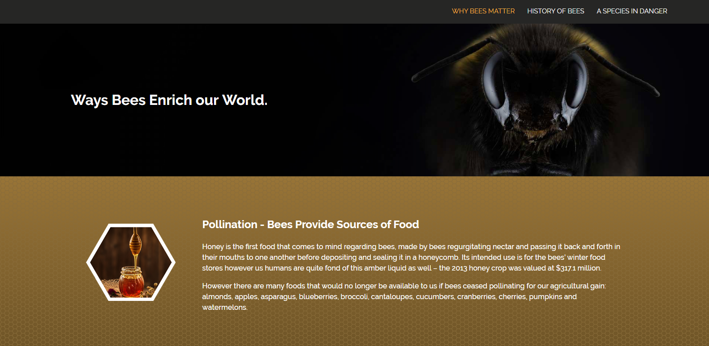

# Bee site built with react

This is a website about Bee's using utilizing React and React Router to better hone my react skills.

Live Link: https://bees-react.netlify.com/

This project was bootstrapped with [Create React App](https://github.com/facebook/create-react-app).

## Available Scripts

In the project directory, you can run:

### `npm install`

This will install the dependencies for the react app to run. 

### `npm start`

Runs the app in the development mode. 
Open [http://localhost:3000](http://localhost:3000) to view it in the browser.
